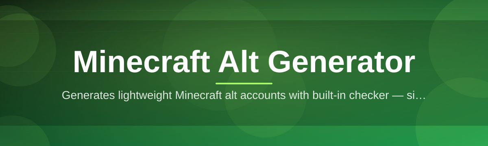
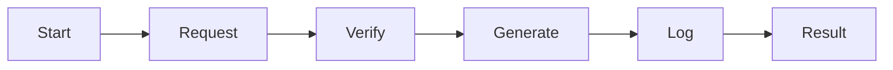

# minecraft-alt-utility 🎮⚡

  

*One click, one alt, zero wasted minutes.*

  

## 🧭 Overview

Making a fresh Minecraft account by hand is a tedious loop: open a browser, mash through email verification, solve a captcha, copy credentials somewhere safe, repeat. Multiply that by however many alt accounts you actually need for testing servers, running plugin QA, or managing a multi-account lobby setup, and it turns into an afternoon you'll never get back.

`minecraft-alt-utility` collapses that whole loop into a single desktop tool. It's a lightweight Windows application built for one purpose: generating usable Minecraft alt accounts in bulk, on demand, with a clean local log of everything it made. No browser extensions, no third-party panels, no subscription dashboards — just an .exe that does the repetitive part so you can get back to actually playing or testing.

This project exists for solo server admins, plugin developers who need throwaway accounts for load testing, and players who just want a fast way to spin up a batch of alts without babysitting a form. It's not a magic bullet and it's not trying to be — it's a purpose-built utility that respects your time.

## 🚀 Get Started

> [!TIP]
> Bookmark the landing page — it always points to the current build, so you never have to hunt for the latest version.

---

## 🧩 What It Actually Does

| Capability | The Fresh Angle |
|---|---|
| **Bulk Alt Generation** | Queue up a batch and let the generator chew through it while you do literally anything else. |
| **Local Credential Vault** | Every generated account lands in a local, encrypted-at-rest log — no cloud sync, no leaked spreadsheets. |
| **One-Click Export** | Dump your batch to `.txt` or `.csv` in a format ready to drop into your favorite launcher. |
| **Retry Intelligence** | Failed attempts get auto-retried with backoff instead of silently dying mid-batch. |
| **Session Fingerprint Rotation** | Each generation cycle rotates its network fingerprint so batches don't collapse into a single blocked pattern. |
| **Zero-Footprint Mode** | Optional setting that skips writing anything to disk — runs entirely in memory for the session. |
| **Built-In Rate Governor** | Self-throttles requests so you're not hammering endpoints like it's a DDoS test. |
| **Dark & Light Shell** | A UI that doesn't fight your eyes at 2am when you're testing a server build. |

> [!NOTE]
> "Alt" here means an additional Minecraft account for legitimate multi-account workflows — testing, development, moderation sandboxes. This tool does not touch anyone else's account or credentials.

---

## 🛫 Up and Running

Getting from zero to your first batch of alts takes about ninety seconds:

1. **Hit the download button** above — it drops you on the official landing page.
2. **Grab the `.exe`** — no installer wizard, no bundled toolbars, just the binary.
3. **Run it** — Windows SmartScreen may flag it since it's an unsigned indie build; click "More info → Run anyway."
4. **Set your batch size and hit Generate** — watch the log panel fill up in real time.

> [!IMPORTANT]
> Because the binary is unsigned, Windows Defender might quarantine it on first run. This is standard for small, independently-shipped tools — always verify you downloaded from the official landing page linked in this README before trusting it.

---

## 🖥️ System Requirements

<strong>Click to expand full requirements</strong>

- Windows 10 or Windows 11 (64-bit)

- No .NET runtime install required — fully self-contained

- No Python, Node, or Java dependency chain to manage

- ~40MB disk space, negligible RAM footprint at idle

- Standard internet connection (no VPN required, though supported)

  

---

## ⚙️ How It Works

The pipeline is intentionally simple — four moving parts, one direction of flow:

1. **Request Builder** assembles a generation request using rotating fingerprint data.
2. **Verification Handler** solves the account-creation handshake automatically.
3. **Credential Writer** logs the finished alt into your local vault or export queue.
4. **Batch Loop** repeats the cycle until your requested quantity is met.

> [!TIP]
> Running a very large batch? Split it into chunks of 20-30 instead of one giant run — the retry governor performs noticeably better with smaller waves.

---

## 🩹 Troubleshooting

**Q: The app opens then closes instantly — what's going on?**
Almost always a leftover antivirus quarantine action. Whitelist the `.exe` folder and relaunch.

**Q: Generation is stuck at "Verifying" for a long time.**
That step depends on live network conditions. Give it 60 seconds; if it hasn't moved, cancel the batch and restart with a smaller size.

**Q: Some accounts fail while others succeed in the same batch.**
Normal — the retry governor logs failures separately so you can re-run just the failed subset instead of the whole batch.

**Q: Exported `.csv` looks garbled in Excel.**
Excel misreads UTF-8 by default. Open it via "Data → From Text/CSV" instead of double-clicking.

**Q: Can I run two instances at once?**
Not recommended — both instances will fight over the same local vault file and one will lose writes.

**Q: Antivirus flags it as a generic "PUA" (Potentially Unwanted App).**
Common for unsigned niche tools. Report it as a false positive to your AV vendor if you're confident in the source.

---

## 🎛️ UI & UX Details

| Shortcut | Action |
|---|---|
| `Ctrl + G` | Start generation batch |
| `Ctrl + E` | Export current log |
| `Ctrl + L` | Clear session log |
| `F5` | Refresh connection status |
| `Ctrl + ,` | Open settings panel |

> [!NOTE]
> The interface ships with **Dark**, **Light**, and **Midnight Blue** themes, all switchable without a restart. Settings persist in a local config file, so your batch-size defaults and theme choice survive updates.

Additional settings worth knowing about:

- Adjustable batch delay (100ms–5000ms) for finer throttling control

- Toggle for automatic `.csv` export after every completed batch

- Optional sound cue when a batch finishes

---

## 🤝 Contributing & Community

This is a solo-maintained project, but issues, feature requests, and pull requests are genuinely welcome. If you find a bug, open an issue with your Windows version and a description of what you saw — logs help enormously.

> [!WARNING]
> Please don't open issues asking for account recovery, unbans, or anything unrelated to this specific tool's functionality — that's outside the scope of what a maintainer here can help with.

Pull requests should stay focused: one feature or fix per PR, please. Bigger architectural changes are welcome as a discussion first so we don't clash on direction.

---

## 📜 License

Released under the [MIT License](LICENSE), 2026. Do what you want with it — attribution appreciated, not required.

---

## ⚠️ Disclaimer

`minecraft-alt-utility` is an independent, unofficial tool and is not affiliated with, endorsed by, or associated with Mojang Studios, Microsoft, or the Minecraft brand in any way. It's built for legitimate multi-account workflows such as development testing, server administration, and moderation sandboxes. Use it responsibly and in line with the terms of service of any platform you interact with — the maintainer is not responsible for how the tool is used downstream.

---

